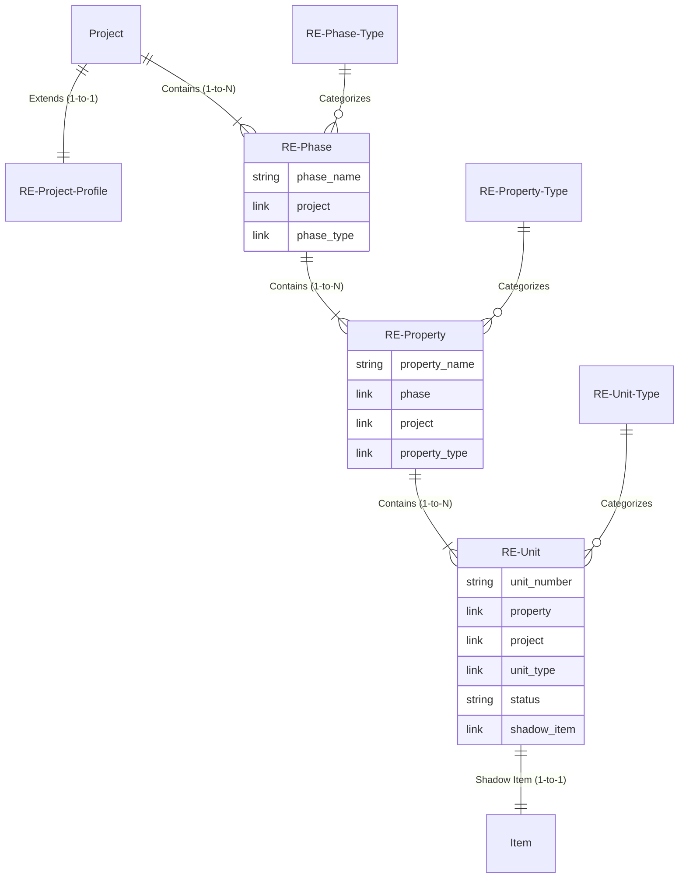

# KayanOS Phase 3 — Architecture Design (Real Estate Domain)

## 1. Executive Summary
This document outlines the architecture for Phase 3: Real Estate Domain in KayanOS. Based on Product Owner decisions, the model adopts a strict 4-level hierarchy: `Project → Phase → Property(Building) → Unit`. It natively protects the canonical ERPNext/BuildSuite `Project`, enforces UI-configurable real estate types, and introduces a robust "Shadow Item" synchronization to bridge the gap between KayanOS real estate attributes and ERPNext's standard selling/billing workflows.

## 2. Relationship Diagram (Mermaid)

## 3. DocType & Field Proposal Matrix

| DocType | Role / Purpose | Key Fields | Relationships / Links |
| :--- | :--- | :--- | :--- |
| **RE Phase** | Logical division of a Project. | `phase_name`, `phase_type`, `status` | Links to canonical `Project`. |
| **RE Property** | Physical building/zone within a Phase. | `property_name`, `property_type`, `status` | Links to `RE Phase` & canonical `Project` (read-only inheritance). |
| **RE Unit** | The sellable/rentable asset. | `unit_number`, `status`, `built_up_area`, `price`, `shadow_item` | Links to `RE Property` & canonical `Project`. |
| **RE Phase Type** | User-configurable classification. | `type_name`, `description` | Standalone Setup DocType. |
| **RE Property Type**| User-configurable classification. | `type_name` (e.g. Building, Villa, Land) | Standalone Setup DocType. |
| **RE Unit Type** | User-configurable classification. | `type_name`, `category` (Residential/Commercial)| Standalone Setup DocType. |

**Consistency Inheritance:** 
A Unit's canonical `Project` is strictly derived and locked based on its parent `RE Property`. Changing a Property's Phase/Project cascades dynamically or is prevented if units exist.

## 4. Unit Lifecycle and Availability

The `RE Unit` handles lifecycle logic strictly isolated from the Shadow Item:

1. **Draft:** Unit is being created/configured. Not available for sale.
2. **Available:** Unit is released. *Validation Rule:* A unit can ONLY become Available if the `RE Project Profile` has `sales_authorized = 1`. If authorization is revoked, Available units transition to `Withheld` or block new bookings.
3. **Reserved:** Blocked temporarily by an active lead/opportunity (Future Phase).
4. **Sold:** Transaction completed (Future Phase).
5. **Withheld / Blocked:** Manually removed from inventory.

## 5. Shadow Item Lifecycle

Every `RE Unit` will possess a 1-to-1 ERPNext `Item` (Shadow Item) to enable future standard selling/invoicing modules without polluting KayanOS attributes.

* **Creation Timing:** Handled in the `after_insert` hook of the `RE Unit`.
* **Atomicity / Failure Handling:** If creating the `Item` fails (e.g., due to downstream ERPNext validation errors), the transaction is rolled back via Frappe's DB transaction manager, preventing orphaned RE Units.
* **Uniqueness:** The Item Code will match the RE Unit's name (e.g., `PROJ-PH1-BLDG1-U01`). Duplicate items are natively prevented by Frappe's primary key constraints on the `Item` doctype.
* **Item Properties:** Created as a non-stock item (`is_stock_item = 0`), disabled if the RE Unit is in `Draft` or `Withheld` status. 

## 6. Scenario Coverage Matrix

| Scenario | Model Behavior |
| :--- | :--- |
| **Internal Developer (Own Project)** | Profile = Internal. Phase/Property/Unit created under the canonical Project. Sales authorized internally. |
| **External Developer (Brokered)** | Profile = External. Units are created and Shadow Items generated. Sales revenues can later map to broker commission accounts. |
| **3rd-Party Construction** | KayanOS Unit models do not conflict with BuildSuite BOQs. Both link back to the canonical Project seamlessly. |
| **Mixed Responsibility** | Handled at the Profile level. If specific phases have different external developers, this requires a design decision (see Unresolved Decisions). |

## 7. Data Integrity, Naming & Archival protections

* **Naming Rule:** Unit name generated via expression: `{project}-{phase}-{property}-{unit_number}`. Guarantees global uniqueness.
* **Deletion Protection:** `LinkExistsError` natively protects Phases and Properties from deletion if child Units exist.
* **Archival:** Archiving a Phase propagates a 'Disabled' state to all child Properties, Units, and Shadow Items.
* **Shadow Item sync:** Updating the Unit's name or price will trigger an `on_update` hook to sync essential fields to the Shadow Item.

## 8. Risks and Unresolved Decisions

1. **[OPEN DECISION]** **Shadow Item Deletion:** If a user deletes an `RE Unit` (assuming no bookings exist), should KayanOS automatically delete the Shadow `Item`, or just set it to `Disabled`? (Deleting items is risky if standard ERPNext logs referenced it).
2. **[OPEN DECISION]** **Phase-Level Ownership:** Currently, `ownership_type` and `sales_authorized` sit on the `RE Project Profile` (Project-level). If a mixed project has Phase 1 (Internal) and Phase 2 (External), should `RE Phase` override or contain its own authorization flags?
3. **[OPEN DECISION]** **Sub-Units:** Does the business require attaching sub-units (e.g., parking spots, storage) to a primary unit, or are they treated as independent `RE Units`?

## 9. Proposed Bounded Phase 3 Implementation Scope

1. Create Configuration DocTypes (`RE Phase Type`, `RE Property Type`, `RE Unit Type`).
2. Create Hierarchy DocTypes (`RE Phase`, `RE Property`, `RE Unit`).
3. Implement `after_insert` and `on_update` lifecycle hooks in `RE Unit` for Shadow Item synchronization.
4. Implement Validation hooks (Project inheritance, checking Profile's `sales_authorized`).
5. Write full integration test suite verifying hierarchy locks, shadow item atomicity, and rollback on failure.
6. **Out of Scope:** Bookings, Contracts, Accounting, portal views, commission routing.
